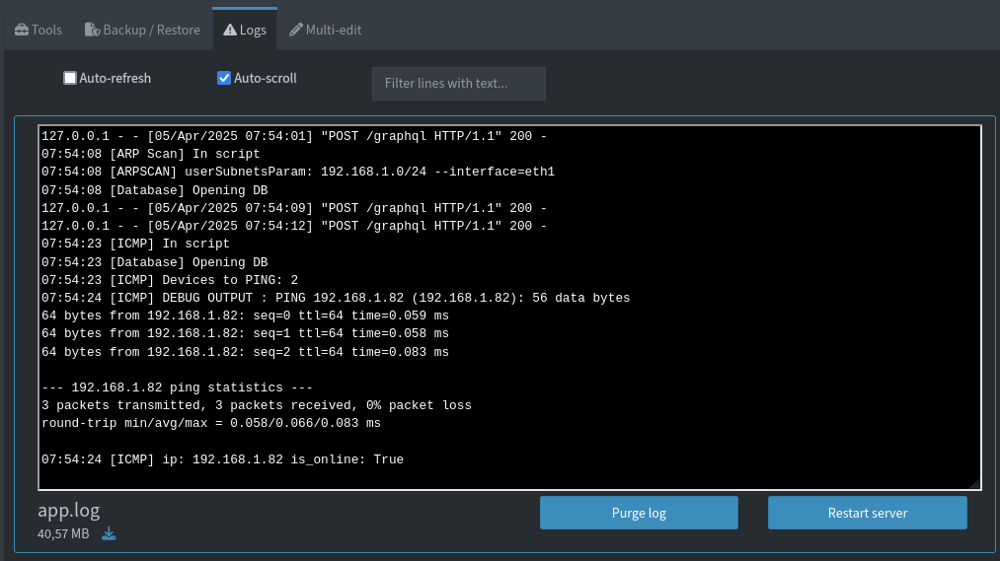

# Logging

NetAlertX comes with several logs that help to identify application issues. These include ngnix logs, app, or plugin logs. For plugin-specific log debugging, please read the [Debug Plugins](./DEBUG_PLUGINS.md) guide.

> [!NOTE]
> When debugging any issue, increase the `LOG_LEVEL` Setting as per the [Debug tips](./DEBUG_TIPS.md) documentation.

## Main logs

You can find most of the logs exposed in the UI under _Maintenance -> Logs_. 

If the UI is inaccessible, you can access them under `/app/log`.



In the _Maintennace -> Logs_ you can **Purge logs**, download the full log file or Filter the lines with some substring to narrow down your search. 

## Plugin logging

If a Plugin supplies data to the main app it's done either vie a SQL query or via a script that updates the `last_result.log` file in the plugin log folder (`app/log/plugins/`). These files are processed at the end of the scan and deleted on successful processing.

The data is in most of the cases then displayed in the application under _Integrations -> Plugins_ (or _Device -> Plugins_ if the plugin is supplying device-specific data). 


## Viewing Logs on the File System

You cannot find any log files on the filesystem. The container is `read-only` and writes logs to a temporary in-memory filesystem (`tmpfs`) for security and performance. The application follows container best-practices by writing all logs to the standard output (`stdout`) and standard error (`stderr`) streams. Docker's logging driver (set in `docker-compose.yml`) captures this stream automatically, allowing you to access it with the `docker logs <image_name>` command.

* **To see all logs since the last restart:**

  ```bash
  docker logs netalertx
  ```
* **To watch the logs live (live feed):**

  ```bash
  docker logs -f netalertx
  ```
## Enabling Persistent File-Based Logs

The default logs are erased every time the container restarts because they are stored in temporary in-memory storage (`tmpfs`). If you need to keep a persistent, file-based log history, follow the steps below.

> [!NOTE]
> This might lead to performance degradation so this approach is only suggested when activelly debuging issues. See the [Performance optimization](./PERFORMANCE.md) documentation for details.

1. Stop the container:

   ```bash
   docker-compose down
   ```

2. Edit your `docker-compose.yml` file:

   * **Comment out** the `/app/log` line under the `tmpfs:` section.
   * **Uncomment** the "Retain logs" line under the `volumes:` section and set your desired host path.

   ```yaml
   ...
       tmpfs:
         # - "/app/log:uid=20211,gid=20211,mode=1700,rw,noexec,nosuid,nodev,async,noatime,nodiratime"
   ...
       volumes:
   ...
         # Retain logs - comment out tmpfs /app/log if you want to retain logs between container restarts
         - /home/adam/netalertx_logs:/app/log
   ...
   ```
3. Restart the container:

   ```bash
   docker-compose up -d
   ```

This change stops Docker from mounting a temporary in-memory volume at `/app/log`. Instead, it "bind mounts" a persistent folder from your host computer (e.g., `/data/netalertx_logs`) to that *exact same location* inside the container. 
